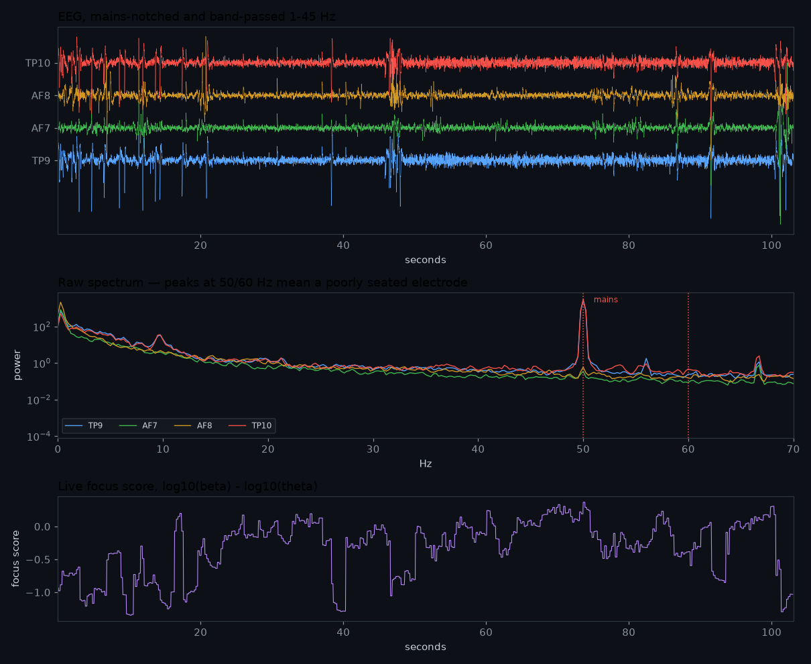

# brain

Multi-person EEG recording with Muse headsets, built to run off-grid.

Several people wear Muse headbands. Each pairs to their own phone over Web
Bluetooth, the phone streams the signal to a Raspberry Pi over WiFi, and the Pi
records everything and shows a live view of everyone at once. No internet, no
cloud, no accounts — a router, a Pi, and whatever phones people already have.

---

## Latest recording

The newest published session is in [`data/latest/`](data/latest/), with a
summary at **[data/latest/SUMMARY.md](data/latest/SUMMARY.md)**.



Every recording captures the full raw signal, not just a summary number:

| Stream | What it is | Rate |
|---|---|---|
| `eeg.csv` | 4 electrodes, microvolts | 256 Hz |
| `ppg.csv` | pulse (Muse 2 only) | 64 Hz |
| `acc.csv` / `gyro.csv` | head motion | ~52 Hz |
| `bands.csv` | per-channel band powers | 4 Hz |
| `telemetry.csv` | derived focus score | 30 Hz |
| `cues.csv` | what the person was asked to do | per event |
| `gaps.csv` | any point where samples were lost | per event |

Have a look:

```bash
pip install -r requirements.txt
python -c "
from analysis.session import Session
s = Session('data/latest')
print(s, s.eeg().shape)
print(s.clean_eeg().head())      # mains hum removed, 1-45 Hz
"
```

See [`data/README.md`](data/README.md) for the file formats and the gotchas
worth knowing before you trust a number.

---

## How it fits together

```
Muse headband  --BLE-->  phone (Chrome)  --wss-->  Raspberry Pi  -->  CSV on disk
                            |                          |
                     computes focus score        live dashboard
                     runs the cued protocol      /dashboard
```

The Pi serves the whole app over HTTPS, so phones just open a URL. **HTTPS is
not optional**: browsers only expose Web Bluetooth on a secure origin, so
without a real certificate the pair button cannot work at all. That is the
single most surprising constraint in this project and the reason for all the
certificate machinery in [`docs/pi-deployment.md`](docs/pi-deployment.md).

**You need Android.** iOS has no Web Bluetooth in any browser, including Chrome
for iOS, so an iPhone or iPad cannot pair a headset. This is a WebKit policy,
not something a setting fixes.

## Running a session

1. Open the site on each phone, pick a seat, pair the headset
2. Check **Headset Fit Status** — if it says *mains hum*, dampen the ear pads
   and clear hair from underneath. A hum-swamped electrode reads as healthy on
   amplitude alone while being almost entirely noise.
3. On the dashboard, name the session and press **Start recording**
4. Press **Start protocol** on a phone to run the cued task — four conditions
   (eyes open/closed × calm/focused), balanced and randomised, with spoken and
   beeped cues so nobody has to watch a screen
5. Stop recording, then `./scripts/publish-session.sh` to put it in `data/`

## Lights

An LED strip can show one wearer's state to the room: **blue when relaxed, red
when concentrated**, with magenta at their calibrated baseline. The score is a
signed drive in `[-1, +1]`, so the middle of the ramp is a real reading rather
than an absence of one.

The strip is driven by a [WLED](https://kno.wled.ge) controller — a GLEDOPTO
Elite ESP32 (`GL-C-615WL`, or `GL-C-616WL` for the Ethernet version) ships with
WLED already flashed. The Pi streams to it over WLED's UDP realtime protocol, so
there is no hub, no MQTT, and nothing to install on the controller.

Prove the wiring before involving any EEG:

```bash
.venv/bin/python led_driver.py 10.0.0.5 --count 144 --check   # holds blue, then red
.venv/bin/python led_driver.py 10.0.0.5 --count 144           # sweeps the full ramp
```

Then hand the address to the server:

```bash
.venv/bin/python server.py --led-host 10.0.0.5 --led-count 144 --led-seat p1
```

Without `--led-host` the strip is simply off, and nothing about the recording
path changes.

**Check the colour order in WLED first.** WS2815 is a GRB part; if WLED is left
on RGB the strip shows the exact *opposite* of the wearer's state and nothing
anywhere reports an error. `--check` exists to catch precisely this.

Two behaviours worth knowing:

- **Sends are fire-and-forget UDP and failures are swallowed.** A controller
  that is unplugged, rebooting, or buried in dust cannot raise into the loop
  that writes the recording. Lights must never be able to cost you data.
- **When the seat drops out, calibrates, or goes stale, the Pi stops sending**
  rather than showing a neutral colour. WLED's own realtime timeout then hands
  the strip back to its local effect after ~2 s, which is a readable signal that
  nobody is driving it.

If the strip drops back to its own effect after about five seconds while the
phone still says it is streaming, the score has stopped *changing* rather than
stopped arriving. Liveness here means a moving value, not incoming frames — a
phone whose headset died keeps sending its last score forever, so an unchanging
reading is treated as a dead source and the seat goes stale. The lights are
reporting that faithfully; look at the headset, not the strip.

## Repository layout

| Path | |
|---|---|
| `server.py` | the Pi: serves the app, collects telemetry, writes recordings |
| `session_recorder.py` | CSV recording, shared by both capture paths |
| `led_driver.py` | drives an LED strip from a seat's focus score |
| `muse-pwa/` | the phone app (React + TypeScript) |
| `analysis/` | loading and summarising recorded sessions |
| `data/latest/` | the most recent published session |
| `scripts/` | certificates, preflight checks, publishing a session |
| `docs/pi-deployment.md` | full setup from a blank Pi |
| `muse_visualizer.py` | earlier desktop visualiser (Mind Monitor over OSC) |

There are two capture paths in this repo. The phone app is the current one; the
Qt visualiser is an earlier single-user route that reads OSC from the Mind
Monitor app. They do not share code and compute their focus score differently —
worth knowing before comparing numbers across them.

## Development

```bash
python -m venv .venv && .venv/bin/pip install -r requirements.txt
QT_QPA_PLATFORM=offscreen .venv/bin/python -m pytest    # 207 tests

cd muse-pwa && npm ci && npm run build
```

Serving locally without a certificate works over `localhost`, which browsers
treat as secure:

```bash
.venv/bin/python server.py --port 8443
```

## A note on the data

EEG is personal. A recording says something about the state of the person who
made it, and once published it cannot be unpublished. Everything in `data/` was
recorded and shared deliberately by the person it came from. Please treat
anyone else's recording the same way, and don't publish a session without
asking whoever wore the headset.
